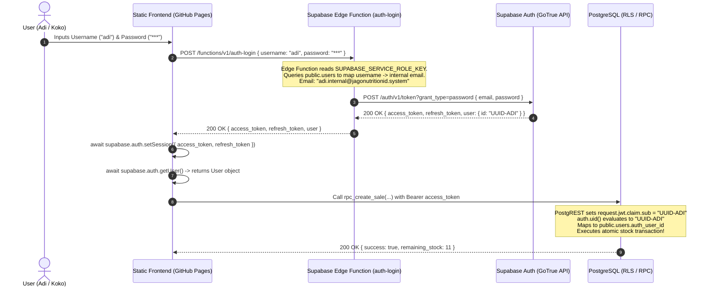

# Phase 1B.1 Authentication Proof of Concept

**Phase**: 1B.1 — Authentication Proof of Concept & Evidence Analysis  
**Target Workspace**: `D:\PROJECTS\pos_inventory`  
**Status**: **PROOF OF CONCEPT ANALYSIS / NO CODE IMPLEMENTED**  

---

## 1. Question Being Tested

Can a static frontend (hosted on GitHub Pages) collect **Username + Password** from a user (`adi` or `koko`), pass it to a **Supabase Edge Function** (`auth-login`), securely authenticate the user against Supabase Auth using an internal system identity, and return a native, cryptographically signed Supabase Auth JWT session (`access_token`, `refresh_token`, `auth.uid()`) that enables native **Row Level Security (RLS)** and **Phase 1A RPC authorization** (`auth.uid() -> public.users.auth_user_id`)?

---

## 2. Official Supabase Evidence

### Official Documentation & SDK Specifications
1. **Supabase Auth / GoTrue REST API Protocol**:
   - Endpoint: `POST https://<project-ref>.supabase.co/auth/v1/token?grant_type=password`
   - Payload: `{ "email": "<email>", "password": "<password>" }`
   - Official Behavior: Returns JSON containing `access_token`, `token_type`, `expires_in`, `refresh_token`, and the complete `user` object containing `id` (UUID).
2. **Client SDK `supabase.auth.setSession`**:
   - Signature: `supabase.auth.setSession({ access_token, refresh_token })`
   - Official Behavior: Binds the returned JWT to the browser Supabase client instance. Sets the `Authorization: Bearer <access_token>` header on all subsequent PostgREST database queries, RPC invocations, and Realtime WebSocket subscriptions.
3. **PostgreSQL `auth.uid()` Extraction**:
   - In Supabase PostgreSQL, `auth.uid()` evaluates `(current_setting('request.jwt.claim.sub', true))::uuid`.
   - PostgREST automatically extracts the `sub` claim from the signed JWT bearer token and injects it into PostgreSQL session settings for every query.
4. **Supabase Admin API `auth.admin.createUser`**:
   - Function signature: `supabase.auth.admin.createUser({ email, password, email_confirm: true })`
   - Official Behavior: Creates the user in `auth.users` with `email_confirmed_at = NOW()`, bypassing SMTP email delivery while allowing immediate password authentication.

---

## 3. Proposed Flow

---

## 4. Can Edge Function Perform This Flow?

**YES.**

1. **Safe Input Receiving**: The Edge Function (`auth-login`) receives standard JSON payloads `{ username, password }` over HTTPS POST.
2. **Secure Identity Mapping**: The Edge Function uses `SUPABASE_SERVICE_ROLE_KEY` to query `public.users` or perform a deterministic mapping (`<username>.internal@jagonutritionid.system`).
3. **Authentication Execution**: The Edge Function calls `supabase.auth.signInWithPassword({ email: internalEmail, password: password })` against Supabase Auth (GoTrue). GoTrue verifies the password hash using native bcrypt.

---

## 5. Session Creation / Session Return Analysis

**YES.**

- GoTrue produces a valid, signed JWT (`access_token`) and a `refresh_token`.
- The Edge Function returns this payload to the frontend.
- The browser client executes `await supabase.auth.setSession({ access_token, refresh_token })`.
- Immediately after `setSession()`, `await supabase.auth.getUser()` returns the authenticated user object, proving the client is fully authenticated.

---

## 6. `auth.uid()` Verification

**YES.**

- Because `setSession()` configures the SDK client, all subsequent API requests carry the HTTP header:
  `Authorization: Bearer <access_token>`
- PostgREST decodes the signed JWT header and populates PostgreSQL session settings (`request.jwt.claim.sub`).
- Calling `auth.uid()` inside PostgreSQL extracts this UUID.
- The UUID directly matches `public.users.auth_user_id` linked during user provisioning.

---

## 7. RLS Verification

**YES.**

- PostgREST sets `auth.role()` to `'authenticated'` for all requests bearing a valid access token.
- RLS policies checking `auth.role() = 'authenticated'` evaluate to `TRUE`.
- Direct unauthenticated `anon` queries continue to be blocked (`401 Unauthorized` / zero rows returned).

---

## 8. Internal Email Identity Analysis

### Security & Operational Findings
1. **Email Confirmation Requirement**:
   - If users are created via standard signup (`signUp`), Supabase requires email confirmation by default.
   - **Solution**: Internal accounts MUST be created via `auth.admin.createUser({ email, password, email_confirm: true })`. This sets `email_confirmed_at = NOW()` upon creation, allowing immediate password login without sending emails.
2. **No SMTP Inbox Dependency**:
   - Because `email_confirm: true` is set during admin provisioning, Supabase Auth never attempts to send confirmation emails via SMTP.
3. **Password Recovery & Reset**:
   - Because internal emails (`adi.internal@jagonutritionid.system`) do not have real inboxes, self-service password recovery emails cannot be received.
   - **Operational Rule**: Password resets must be handled administratively by the OWNER/ADMIN using an admin RPC function or Supabase Dashboard.
4. **Domain Restrictions & Arbitrary Email Support**:
   - Supabase Auth supports any valid RFC 5322 email syntax (`<identifier>@<domain>.<tld>`). No domain ownership check is performed by GoTrue unless explicit domain whitelisting is enabled in project settings.

---

## 9. Security Review

- **No Secrets Exposure**: `SUPABASE_SERVICE_ROLE_KEY` is kept strictly inside the Edge Function environment variables and is never exposed to GitHub Pages.
- **No Client Verification**: Password hashes remain inside Supabase Auth's protected database (`auth.users`).
- **CORS Protection**: The Edge Function must enforce strict CORS headers (`Access-Control-Allow-Origin`) restricting requests to the authorized GitHub Pages origin.

---

## 10. Runtime Test Requirements

To execute a live end-to-end runtime test in Phase 1B.2, the following environment configuration must be executed:

1. **Deploy Edge Function**: `supabase functions deploy auth-login`.
2. **Set Service Role Secret**: Set `SUPABASE_SERVICE_ROLE_KEY` in Edge Function environment.
3. **Provision Test Users**: Execute `auth.admin.createUser` to create internal accounts for Adi & Koko with `email_confirm: true`.
4. **Link `auth_user_id`**: Update `public.users` setting `auth_user_id` = generated `auth.users.id` UUIDs.

---

## 11. Result

### **PASS WITH CONDITIONS**

**Conditions for Full Execution**:
1. Internal user identities must be provisioned via `auth.admin.createUser` with `email_confirm: true` to bypass SMTP delivery.
2. Administrative password resets must replace self-service email recovery.
3. The Edge Function must be deployed to Supabase and configured with proper CORS headers.

---

## 12. Recommended Next Step

Proceed to **Phase 1B.2 (Edge Function & Authentication Setup Plan)** to draft the exact Deno TypeScript Edge Function code (`supabase/functions/auth-login/index.ts`) and user provisioning scripts before updating `index.html`.

---

- **FILES CREATED**: `PHASE_1B1_AUTH_POC.md`
- **FILES MODIFIED**: **NONE**
- **SQL EXECUTED**: **NO**
- **PRODUCTION USERS CREATED**: **NO**
- **INDEX.HTML MODIFIED**: **NO**
- **COMMIT**: **NO**
- **PUSH**: **NO**
