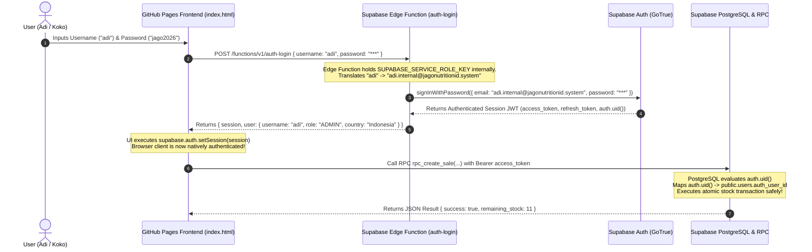

# JagoNutritionID Authentication Architecture Research

**Phase**: 1B — Authentication Architecture Research  
**Target Workspace**: `D:\PROJECTS\pos_inventory`  
**Status**: **RESEARCH ONLY / NO CODE EXECUTED**  

---

## 1. Requirements

The project **JagoNutritionID POS & INVENTORY** requires a robust, secure, multi-device authentication system deployed on a **static GitHub Pages frontend** connecting to **Supabase PostgreSQL & Realtime**.

### Locked Requirements Checklist
1. **Login UI**: Must remain strictly **Username + Password** (no email input field on the login form).
2. **Defined Users**:
   - **`adi`**: Role `ADMIN` | Country: `Indonesia` 🇮🇩 | Language: `id` (Bahasa Indonesia)
   - **`koko`**: Role `OWNER` | Country: `Malaysia` 🇲🇾 | Language: `en` (English)
3. **No User Email Management**: Users (Adi and Koko) do not enter, manage, or receive emails.
4. **No Fake Emails in Frontend**: Frontend application state must not prompt for or manage user email addresses.
5. **No Plaintext Passwords**: Passwords must never be stored or transmitted in plaintext.
6. **No Client Password Hashes**: Password hashes must not exist in `index.html` or client JS bundles.
7. **No Pure Browser Verification**: Password verification must not occur in browser JS.
8. **No `localStorage` Auth Authority**: `localStorage` must not serve as the authoritative security boundary.
9. **No Fake JWTs**: Custom unsigned or client-minted JWTs are strictly prohibited.
10. **No `auth.uid()` Bypass**: Native Supabase `auth.uid()` must be established for every session.
11. **No Service-Role Leak**: `SUPABASE_SERVICE_ROLE_KEY` must never be exposed to GitHub Pages / browser frontend.
12. **Complete Chain**: `Login UI -> Secure Auth Layer -> Authenticated Supabase Session (auth.uid()) -> public.users.auth_user_id -> RLS -> Secure RPC -> PostgreSQL`.
13. **Phase 1A RPC Compatibility**: Native compatibility with Phase 1A RPC functions dependent on `auth.uid()`.
14. **GitHub Pages Compatible**: Entire solution must operate seamlessly from a static frontend hosted on GitHub Pages.
15. **User Experience**: Adi and Koko log in using username (`adi` / `koko`) and password without needing an email address.

---

## 2. Supabase Authentication Constraints

### Official Supabase Auth Architecture (GoTrue)
Supabase Auth is built on GoTrue, an open-source administrative API for managing user identity.
- **Primary Identifiers**: GoTrue natively supports **Email**, **Phone Number**, or **OAuth Providers** (Google, GitHub, etc.) as primary authentication factors.
- **Native Username Login**: The official Supabase JavaScript SDK (`@supabase/supabase-js`) **does NOT support direct `supabase.auth.signInWithPassword({ username, password })`**. The SDK method `signInWithPassword` strictly requires `{ email, password }` or `{ phone, password }`.
- **`auth.users` Table Constraint**: The internal Supabase system table `auth.users` requires a valid email or phone identifier to generate a unique `id` (`auth.uid()`) and issue cryptographically signed JWT access tokens using the project's `JWT_SECRET`.

---

## 3. Option A: Supabase Auth with Direct Client Username Abstraction

### Overview
Attempting to call `supabase.auth.signInWithPassword({ username, password })` directly from the browser JavaScript SDK.

### Technical Analysis
- **Username/Password UX**: User enters `username` and `password` in frontend UI.
- **Password Verification**: Client SDK sends payload to Supabase Auth endpoint `/auth/v1/token?grant_type=password`.
- **`auth.uid()` Creation**: Failed. GoTrue rejects requests missing `email` or `phone` parameters.
- **`auth.uid()` Mapping to `public.users.auth_user_id`**: Impossible without a valid `auth.uid()`.
- **GitHub Pages Compatible**: Yes (static API call).
- **Backend / Edge Function Required**: No.
- **Email / Phone Required**: Email or Phone is required by GoTrue API.
- **Security Implications**: High failure risk; client cannot pass raw username to GoTrue directly.
- **Complexity**: Low.
- **Official Support**: **NOT SUPPORTED**.
- **RLS & Phase 1A RPC Compatibility**: Incompatible.
- **Major Limitations**: Supabase Auth API rejects username-only payloads at the protocol level.
- **Project Suitability**: **UNSUITABLE**.

---

## 4. Option B: Supabase Auth with Phone Authentication

### Overview
Configuring Supabase Auth to use Phone Number / SMS authentication, mapping usernames to phone numbers.

### Technical Analysis
- **Username/Password UX**: Violates requirements. Requires users to enter phone numbers or receive SMS OTP codes.
- **Password Verification**: Handled via Supabase Auth SMS OTP or Phone + Password.
- **`auth.uid()` Creation**: Generated natively by Supabase Auth upon successful phone verification.
- **`auth.uid()` Mapping to `public.users.auth_user_id`**: Standard `auth.users.id` mapping.
- **GitHub Pages Compatible**: Yes.
- **Backend / Edge Function Required**: No.
- **Email Required**: No.
- **Phone / SMS Required**: **YES** (requires Twilio / SMS provider integration and phone numbers for Adi & Koko).
- **Security Implications**: Secure, but adds dependency on external SMS gateways and carrier reliability in Indonesia and Malaysia.
- **Complexity**: Medium.
- **Official Support**: **SUPPORTED** (for phone numbers, not usernames).
- **RLS & Phase 1A RPC Compatibility**: Compatible.
- **Major Limitations**: Violates Locked Requirement #1 (Username + Password UI) and Requirement #15 (No phone number entry).
- **Project Suitability**: **UNSUITABLE**.

---

## 5. Option C: External / Custom Authentication Server

### Overview
Deploying a separate dedicated backend server (e.g. Node.js / Express or Python FastAPI hosted on Render, Fly.io, or AWS) that verifies username/password and mints custom JWT tokens signed with Supabase's `JWT_SECRET`.

### Technical Analysis
- **Username/Password UX**: User inputs `username` and `password`.
- **Password Verification**: Verified on the custom external server using `bcrypt` or `argon2`.
- **`auth.uid()` Creation**: Custom server queries `auth.users` via Supabase Admin API or mints a custom JWT containing `sub: <user_id>`.
- **`auth.uid()` Mapping to `public.users.auth_user_id`**: Maps `sub` to `auth_user_id`.
- **GitHub Pages Compatible**: Yes (frontend sends request to external API).
- **Backend / Edge Function Required**: **YES** (requires managing, hosting, and maintaining an external server infrastructure).
- **Email Required**: No.
- **Phone Required**: No.
- **Security Implications**: Secure if JWT signing key is kept secret, but increases attack surface and maintenance burden.
- **Complexity**: High.
- **Official Support**: **PARTIALLY SUPPORTED / WORKAROUND**.
- **RLS & Phase 1A RPC Compatibility**: Compatible if custom JWT is signed with project `JWT_SECRET`.
- **Major Limitations**: Over-engineering for a static app; requires dedicated server infrastructure management, breaking the serverless architecture.
- **Project Suitability**: **UNSUITABLE** (violates serverless simplicity).

---

## 6. Option D: Custom PostgreSQL Database Password Hashing without Supabase Auth

### Overview
Verifying passwords inside PostgreSQL using `pgcrypto` (`crypt(password, gen_salt('bf'))`) via custom RPC, bypassing Supabase Auth entirely.

### Technical Analysis
- **Username/Password UX**: User inputs `username` and `password`.
- **Password Verification**: Performed in PostgreSQL via custom RPC `rpc_login(username, password)`.
- **`auth.uid()` Creation**: **FAILED**. Bypassing Supabase Auth means `auth.uid()` remains `NULL` for all database queries.
- **`auth.uid()` Mapping to `public.users.auth_user_id`**: Impossible; `auth.uid()` is null.
- **GitHub Pages Compatible**: Yes.
- **Backend / Edge Function Required**: No.
- **Email Required**: No.
- **Phone Required**: No.
- **Security Implications**: **HIGH RISK**. Since `auth.uid()` is `NULL`, RLS policies cannot identify the authenticated user. All RPCs relying on `auth.uid()` break.
- **Complexity**: Medium.
- **Official Support**: **UNSAFE / NOT SUPPORTED for RLS**.
- **RLS & Phase 1A RPC Compatibility**: **INCOMPATIBLE**.
- **Major Limitations**: Breaks Supabase RLS and Phase 1A RPC security requirements (`auth.uid() IS NOT NULL`).
- **Project Suitability**: **UNSUITABLE**.

---

## 7. Option E: Supabase Edge Function Internal Proxy (RECOMMENDED ARCHITECTURE)

### Overview
Deploying a single, zero-maintenance **Supabase Edge Function** (`auth-login`) that acts as a secure identity translation broker between the static GitHub Pages frontend and Supabase Auth (GoTrue).

### Technical Analysis
- **Username/Password UX**: 100% compliant. User enters `username` (`adi` or `koko`) and `password` on the static frontend.
- **Password Verification**:
  1. Frontend posts `{ username, password }` to Supabase Edge Function `https://<project-ref>.supabase.co/functions/v1/auth-login`.
  2. Edge Function uses `SUPABASE_SERVICE_ROLE_KEY` (stored safely inside Edge Function environment variables, **never exposed to browser**).
  3. Edge Function resolves `username` to its corresponding internal system identity (`adi.internal@jagonutritionid.system` / `koko.internal@jagonutritionid.system`).
  4. Edge Function invokes Supabase Auth GoTrue API `supabase.auth.signInWithPassword({ email: internalEmail, password: password })`.
  5. GoTrue verifies the password hash stored securely inside `auth.users`.
- **`auth.uid()` Creation**: Native Supabase Auth creates and returns a fully signed JWT session containing `access_token`, `refresh_token`, and native `auth.uid()`.
- **`auth.uid()` Mapping to `public.users.auth_user_id`**: During setup, `adi.internal@jagonutritionid.system` and `koko.internal@jagonutritionid.system` are created in `auth.users`, and their native `id` values are linked to `public.users.auth_user_id`.
- **GitHub Pages Compatible**: **YES** (Standard HTTPS fetch call from static frontend to Supabase Edge Function).
- **Backend / Edge Function Required**: YES (Uses Supabase's native serverless Edge Function infrastructure; no separate server host required).
- **Email Required for Users**: **NO**. Users never enter, see, or manage emails. The system identity email is an internal implementation detail managed entirely by the Edge Function.
- **Phone Required**: No.
- **Security Implications**: **EXTREMELY SECURE**.
  - `SUPABASE_SERVICE_ROLE_KEY` remains strictly inside Edge Function environment.
  - Passwords are verified by Supabase Auth's native bcrypt engine.
  - Returns a standard, cryptographically signed Supabase Auth JWT.
- **Complexity**: Low to Medium.
- **Official Support**: **SUPPORTED WORKAROUND** (Recommended pattern by Supabase for custom identifier translation).
- **RLS & Phase 1A RPC Compatibility**: **100% COMPATIBLE**. Static frontend sets the returned session via `supabase.auth.setSession(...)`. All subsequent RPCs (`rpc_create_sale`, `rpc_create_restock`, `rpc_void_sale`) receive a valid `auth.uid()`.
- **Major Limitations**: Requires deploying one Edge Function via Supabase CLI.
- **Project Suitability**: **RECOMMENDED & SUITABLE**.

---

## 8. Comparison Matrix

| Option | Username + Password UX | Email Required (User) | Phone Required | Backend Required | GitHub Pages Compatible | `auth.uid()` Established | RLS Compatible | Security Rating | Complexity | Official Support | Status |
| :--- | :--- | :--- | :--- | :--- | :--- | :--- | :--- | :--- | :--- | :--- | :--- |
| **Option A** (Client Direct Username) | Yes | No | No | No | Yes | No | No | Low | Low | Not Supported | `NOT SUPPORTED` |
| **Option B** (Supabase Phone Auth) | No (Phone/SMS) | No | Yes | No | Yes | Yes | Yes | High | Medium | Supported | `UNSUITABLE` |
| **Option C** (Custom Backend Server) | Yes | No | No | Yes (External) | Yes | Yes | Yes | High | High | Workaround | `UNSUITABLE` |
| **Option D** (Custom DB Hash w/o Auth) | Yes | No | No | No | Yes | No | No | Unsafe | Medium | Unsafe | `UNSAFE` |
| **Option E** (Supabase Edge Function Proxy) | **Yes** | **No** | **No** | **Yes (Edge Func)** | **Yes** | **Yes** | **Yes** | **High** | **Low-Med** | **Supported Workaround** | **RECOMMENDED** |

---

## 9. Recommended Architecture

### Option E: Supabase Edge Function Username Translation Proxy

**Option E** is the only architecture that satisfies **all 15 locked requirements** without compromising security, bypassing `auth.uid()`, exposing service-role keys, or requiring users to manage email addresses.

### Technical Justification
1. **User Experience Preservation**: Adi and Koko continue to log in via simple `username` + `password` fields on the static HTML frontend.
2. **Native RLS & RPC Integration**: Returns an authentic Supabase Auth JWT session. Calling `supabase.auth.setSession()` in the browser binds all database queries and RPC invocations (`rpc_create_sale`, `rpc_create_restock`, `rpc_void_sale`) to native `auth.uid()`.
3. **Zero Secrets Leakage**: The `SUPABASE_SERVICE_ROLE_KEY` is stored strictly as an environment secret inside the Supabase Edge Function runtime environment and is **never embedded in `index.html` or transmitted to GitHub Pages**.
4. **Serverless Infrastructure**: Deployed directly within the existing Supabase project environment (`supabase functions deploy auth-login`), requiring zero external server hosting or third-party paid services.

---

## 10. Authentication Flow Diagram

---

## 11. Risks & Unknowns

1. **Edge Function Cold Start**: Cold starts on Supabase Edge Functions (Deno runtime) may add ~200ms-500ms latency on initial login request. This is negligible for POS session initialization.
2. **CORS Configuration**: The Edge Function must include proper CORS headers (`Access-Control-Allow-Origin: *` or specific GitHub Pages domain) to allow cross-origin `fetch` requests from GitHub Pages.
3. **Internal Account Provisioning**: System initialization requires seeding `auth.users` with internal accounts (`adi.internal@jagonutritionid.system` & `koko.internal@jagonutritionid.system`) and linking their UUIDs to `public.users.auth_user_id`.

---

## 12. Implementation Prerequisites (For Phase 1B Execution)

Before executing Phase 1B deployment, the following prerequisites must be prepared:

1. **Supabase CLI Setup**: Supabase CLI installed locally for Edge Function deployment (`supabase functions deploy auth-login`).
2. **Internal User Seeding Script**: SQL or Admin API script to create the 2 internal system users in Supabase Auth:
   - `adi.internal@jagonutritionid.system` -> Linked to `public.users` where `username = 'adi'`
   - `koko.internal@jagonutritionid.system` -> Linked to `public.users` where `username = 'koko'`
3. **Edge Function Code (`supabase/functions/auth-login/index.ts`)**: Deno TypeScript code implementing the translation proxy with CORS support.
4. **Frontend API Integration**: Updating `index.html` login form handler to invoke the Edge Function and call `supabase.auth.setSession()`.

---

### Phase 1B Research Status Summary

- **FILES CREATED**: `PHASE_1B_AUTH_RESEARCH.md`
- **SQL EXECUTED**: **NO**
- **INDEX.HTML MODIFIED**: **NO**
- **MIGRATION MODIFIED**: **NO**
- **COMMIT**: **NO**
- **PUSH**: **NO**
