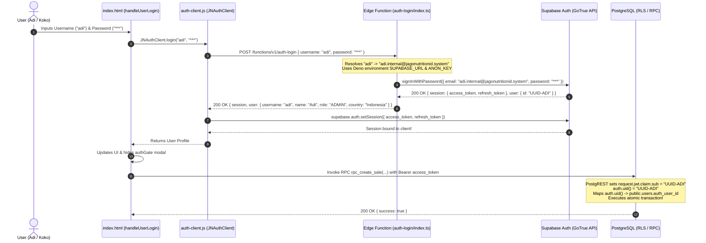

# JagoNutritionID POS & INVENTORY — PHASE 1C AUTHENTICATION DESIGN

**Phase**: 1C — Build Authentication Layer Design & Implementation  
**Target Workspace**: `D:\PROJECTS\pos_inventory`  
**Status**: **IMPLEMENTED LOCALLY / NO PRODUCTION CODE EXECUTED / NO SQL EXECUTED**  

---

## 1. Overview & Architecture

Phase 1C implements the secure, native authentication layer for **JagoNutritionID POS & INVENTORY**.

### Architecture
```
GitHub Pages Frontend (index.html)
        ↓
Username + Password
        ↓
Supabase Edge Function (auth-login/index.ts)
        ↓
Internal Supabase Auth Identity Translation
        ↓
Supabase Auth (GoTrue signInWithPassword)
        ↓
Native JWT Session (access_token, refresh_token, auth.uid())
        ↓
Frontend Client (supabase.auth.setSession)
        ↓
PostgreSQL RLS & SECURITY DEFINER RPCs (auth.uid() -> public.users.auth_user_id)
```

---

## 2. Supabase Edge Function (`auth-login`) Security & Code Design

### File Location
[`supabase/functions/auth-login/index.ts`](file:///D:/PROJECTS/pos_inventory/supabase/functions/auth-login/index.ts)

### Functionality
- Accepts HTTP POST requests containing JSON `{ username, password }`.
- Sanitizes and normalizes username input (`username.trim().toLowerCase()`).
- Rejects missing inputs with HTTP 400 Bad Request.
- Rejects unmapped usernames with generic HTTP 401 Unauthorized (`"Username atau password tidak sesuai."`) to prevent username enumeration attacks.
- Resolves valid usernames against a secure internal lookup table.
- Invokes Supabase Auth GoTrue API (`supabase.auth.signInWithPassword({ email: internalEmail, password: password })`).
- Returns only sanitized session tokens (`access_token`, `refresh_token`, `expires_in`) and non-sensitive user metadata (`id`, `username`, `name`, `role`, `country`).
- **Zero Secrets Leakage**: `SUPABASE_SERVICE_ROLE_KEY` remains strictly inside Edge Function environment secrets. Internal system emails and password hashes are **never returned to the browser**.

---

## 3. CORS Configuration

### Production Origin
Production deployment targets GitHub Pages:
```
Access-Control-Allow-Origin: https://jagonutritionid-crypto.github.io
```

### Dynamic Origin Handling
The Edge Function evaluates the incoming `Origin` header dynamically:
```typescript
function getCorsHeaders(requestOrigin: string | null): HeadersInit {
  let origin = "https://jagonutritionid-crypto.github.io";
  if (requestOrigin) {
    if (
      requestOrigin === "https://jagonutritionid-crypto.github.io" ||
      requestOrigin.startsWith("http://localhost:") ||
      requestOrigin.startsWith("http://127.0.0.1:")
    ) {
      origin = requestOrigin;
    }
  }

  return {
    "Access-Control-Allow-Origin": origin,
    "Access-Control-Allow-Methods": "POST, OPTIONS",
    "Access-Control-Allow-Headers": "authorization, x-client-info, apikey, content-type",
    "Access-Control-Max-Age": "86400",
    "Content-Type": "application/json",
  };
}
```
*Notice: Wildcard `Access-Control-Allow-Origin: *` is strictly avoided in production configuration.*

---

## 4. Frontend Authentication Client (`supabase/auth-client.js`)

### File Location
[`supabase/auth-client.js`](file:///D:/PROJECTS/pos_inventory/supabase/auth-client.js)

### Functionality
- Pure vanilla JavaScript module compatible with static browser environments without npm build dependencies.
- Integrates with Supabase Edge Function: `supabaseClient.functions.invoke('auth-login', { body: { username, password } })`.
- Receives native session and invokes `await supabaseClient.auth.setSession({ access_token, refresh_token })`.
- Listens to Supabase Auth state changes via `onAuthStateChange`.
- Manages local profile cache without storing plain passwords or password hashes.
- Provides `logout()` calling native `supabaseClient.auth.signOut()`.

---

## 5. Username Resolution & Identity Table

| Username | Name | Role | Country | Internal System Identity Email |
| :--- | :--- | :--- | :--- | :--- |
| **`adi`** | Adi | ADMIN | Indonesia 🇮🇩 | `adi.internal@jagonutritionid.system` |
| **`koko`** | Koko | OWNER | Malaysia 🇲🇾 | `koko.internal@jagonutritionid.system` |

---

## 6. User Provisioning Procedure (For Adi & Koko)

**Do NOT store production passwords in source code files.**

To provision accounts prior to Phase 1D deployment, execute the following administrative command using Supabase CLI or Supabase Administrative script:

```typescript
// Administrative User Provisioning Script (Run via Supabase CLI or Admin Console)
import { createClient } from "@supabase/supabase-js";

const supabaseAdmin = createClient(
  process.env.SUPABASE_URL!,
  process.env.SUPABASE_SERVICE_ROLE_KEY!
);

async function provisionUsers() {
  // 1. Provision Adi
  const { data: userAdi, error: errAdi } = await supabaseAdmin.auth.admin.createUser({
    email: "adi.internal@jagonutritionid.system",
    password: "<PROD_PASSWORD_ADI>", // Provided securely at runtime
    email_confirm: true
  });

  // 2. Provision Koko
  const { data: userKoko, error: errKoko } = await supabaseAdmin.auth.admin.createUser({
    email: "koko.internal@jagonutritionid.system",
    password: "<PROD_PASSWORD_KOKO>", // Provided securely at runtime
    email_confirm: true
  });

  console.log("Adi UUID:", userAdi?.user?.id);
  console.log("Koko UUID:", userKoko?.user?.id);
}
```

---

## 7. `public.users.auth_user_id` Mapping Strategy

Once `auth.users` records are provisioned, execute a SQL update in the Supabase SQL Editor to bind the generated UUIDs to `public.users`:

```sql
-- Bind Generated Auth UUIDs to public.users (Run after user provisioning)
UPDATE public.users 
SET auth_user_id = '<GENERATED_ADI_UUID>' 
WHERE username = 'adi';

UPDATE public.users 
SET auth_user_id = '<GENERATED_KOKO_UUID>' 
WHERE username = 'koko';
```

---

## 8. Minimal Integration Point Inspection in `index.html`

We inspected [`index.html`](file:///D:/PROJECTS/pos_inventory/index.html) lines 2116-2218 (`handleUserLogin`).

### Current Implementation (Lines 2116-2130)
```javascript
async function handleUserLogin(e) {
  e.preventDefault();
  const usernameInput = document.getElementById("loginUsername").value.trim().toLowerCase();
  const passInput = document.getElementById("loginPassword").value;
  ...
```

### Minimal Integration Point for Phase 1D
In Phase 1D, `handleUserLogin` will be updated to delegate authentication to `window.JNAuthClient.login(usernameInput, passInput)`:

```javascript
// Minimal Integration Point Replacement
try {
  const userProfile = await window.JNAuthClient.login(usernameInput, passInput);
  currentUser = userProfile;
  updateUserProfileUI();
  document.getElementById("authGate").classList.add("hidden");
  showToast(`Welcome, ${currentUser.name}! (${currentUser.role} - ${currentUser.country})`, "success");
} catch (err) {
  showToast(err.message || "Username atau password tidak sesuai.", "error");
}
```
*This requires zero changes to the HTML layout or styling.*

---

## 9. End-to-End Authentication Flow Diagram


