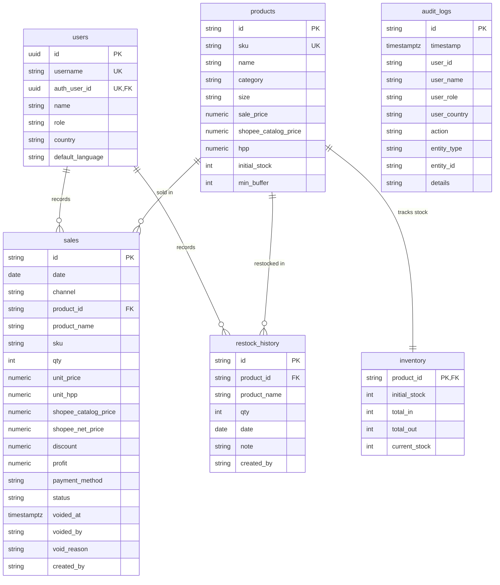

# JAGO NUTRITION ID POS & INVENTORY — DATABASE DESIGN & ARCHITECTURE (FINAL HARDENED PASS)

**Phase**: 1A — Database Design & SQL Migration Draft (Final Hardened Pass)  
**Target Workspace**: `D:\PROJECTS\pos_inventory`  
**Status**: **DRAFT ONLY / NOT EXECUTED**  

---

## 1. TABLE ARCHITECTURE

The target database design replaces the monolithic single-row JSON blob (`prosupps_shared_state`) with a normalized PostgreSQL relational database.

### Core Tables Summary

| Table Name | Description | Primary Key | Key Foreign Keys / Constraints |
| :--- | :--- | :--- | :--- |
| **`users`** | System operators (Adi: ADMIN/ID, Koko: OWNER/MY) | `id` (UUID) | Unique `username`, Nullable FK `auth_user_id` -> `auth.users(id)`, Role & Country CHECKs |
| **`products`** | Product master (4 SKUs, prices, HPPs, min buffer) | `id` (VARCHAR / SKU) | Unique `sku`, Non-negative price & HPP CHECKs |
| **`inventory`** | Realtime physical stock state & counters | `product_id` | FK `products(id)`, `CHECK (current_stock >= 0)` |
| **`sales`** | Sales transaction history & immutable price snapshots | `id` (VARCHAR) | FK `products(id)`, FK `users(id)`, Status CHECK (`ACTIVE`/`VOIDED`), Shopee pricing CHECK |
| **`restock_history`** | Inbound inventory additions ledger | `id` (VARCHAR) | FK `products(id)`, FK `users(id)`, `CHECK (qty > 0)` |
| **`audit_logs`** | Append-only system audit trail | `id` (VARCHAR) | Immutable event log with timestamp index |

---

## 2. ENTITY RELATIONSHIPS & ER DIAGRAM



---

## 3. STOCK ARCHITECTURE & INVARIANT EVALUATION

### Maintained `current_stock` with DB Constraint & Invariant Guarantee
- **Invariant**: `current_stock = initial_stock + total_in - total_out`
- **Performance**: Instant `O(1)` reads for inventory status views and UI rendering.
- **Hard Overselling Protection**: Enforces `CHECK (current_stock >= 0)` at the PostgreSQL engine level.
- **Concurrency Safety**: Enables PostgreSQL row locking (`SELECT current_stock ... FOR UPDATE`) inside atomic RPC procedures.
- **Auditability**: Can be independently verified at any time against ledger sums: `current_stock == initial_stock + total_in - total_out`.

---

## 4. HARDENED ROW LEVEL SECURITY (RLS) STRATEGY

### Complete Removal of Permissive Policies
All permissive policies using `USING (true)` or `WITH CHECK (true)` for public write/read have been completely removed.
- **`anon` Role Access**: Zero access to SELECT, INSERT, UPDATE, or DELETE business data.
- **`authenticated` Role Access**: Read-only SELECT access granted to logged-in users (`auth.role() = 'authenticated'`).
- **Mutation Control**: Direct client-side INSERT, UPDATE, or DELETE queries on sales, inventory, and restock tables are blocked. All state mutations MUST execute via SECURITY DEFINER stored procedures.

---

## 5. HARDENED RPC SECURITY & SESSIONS

### 1. Trusted User Identity Derivation (`auth.uid()`)
RPC signatures no longer accept caller-supplied identity parameters (`p_created_by` or `p_user_id`). Instead, the procedure automatically resolves the caller identity by querying:
```sql
SELECT * INTO v_user 
FROM public.users 
WHERE auth_user_id = auth.uid() AND is_active = true;
```
If `auth.uid()` is null or unmapped, the procedure halts execution immediately (`RAISE EXCEPTION 'Access Denied: Authentication required.'`).

### 2. Search Path Security
All `SECURITY DEFINER` procedures explicitly declare:
```sql
SET search_path = public, pg_temp
```

### 3. Execution Privilege Hardening
Default `PUBLIC` and `anon` execution privileges are revoked:
```sql
REVOKE EXECUTE ON FUNCTION public.rpc_create_sale(...) FROM PUBLIC, anon;
REVOKE EXECUTE ON FUNCTION public.rpc_create_restock(...) FROM PUBLIC, anon;
REVOKE EXECUTE ON FUNCTION public.rpc_void_sale(...) FROM PUBLIC, anon;

GRANT EXECUTE ON FUNCTION public.rpc_create_sale(...) TO authenticated;
GRANT EXECUTE ON FUNCTION public.rpc_create_restock(...) TO authenticated;
GRANT EXECUTE ON FUNCTION public.rpc_void_sale(...) TO authenticated;
```

---

## 6. STATUS-BASED ACCOUNTING & VOID INTEGRITY

To maintain accounting and ledger integrity:
1. `rpc_void_sale(p_sale_id, p_reason)` acquires pessimistic locks on both `sales` and `inventory` rows (`FOR UPDATE`).
2. **Double-Void Guard**: If `sales.status == 'VOIDED'`, the function throws `RAISE EXCEPTION 'Transaction % has already been voided.'`, preventing double stock restoration.
3. **Data Inconsistency Check**: Verifies `total_out >= v_sale.qty`. If `total_out < v_sale.qty`, throws `RAISE EXCEPTION` and rolls back the entire transaction without altering stock or status.
4. If valid, stock is atomically restored (`total_out = total_out - v_sale.qty`, `current_stock = current_stock + v_sale.qty`).
5. Transaction record updated to `status = 'VOIDED'`.
6. Audit log entry inserted.

---

## 7. AUTHENTICATION DEPENDENCY (PHASE 1B BLOCKER)

- `users.auth_user_id` is defined as a nullable Foreign Key `REFERENCES auth.users(id) ON DELETE SET NULL`.
- **Username Requirement**: Adi (`adi` - ADMIN / ID) & Koko (`koko` - OWNER / MY).
- **Hard Blocker Notice**: The database migration `001_initial_schema.sql` MUST NOT be executed against production until the Phase 1B secure authentication layer (e.g. custom username auth RPC or Supabase Auth linking) is fully implemented and verified.

---

## 8. SUMMARY REPORT FOR FINAL PASS

### A. Files Modified
1. [`supabase/migrations/001_initial_schema.sql`](file:///D:/PROJECTS/pos_inventory/supabase/migrations/001_initial_schema.sql)
2. [`supabase/DATABASE_DESIGN.md`](file:///D:/PROJECTS/pos_inventory/supabase/DATABASE_DESIGN.md)

### B. Summary of Final Fixes
- Added nullable FK `auth_user_id REFERENCES auth.users(id) ON DELETE SET NULL` for native Supabase Auth compatibility.
- Added inventory total_out sanity check (`total_out >= v_sale.qty`) in `rpc_void_sale` and removed `GREATEST(0, ...)`.
- Added pessimistic locking (`FOR UPDATE`) on inventory rows in `rpc_create_restock` and `rpc_void_sale`.
- Verified that all mutation RPCs strictly preserve the inventory invariant `current_stock = initial_stock + total_in - total_out`.
